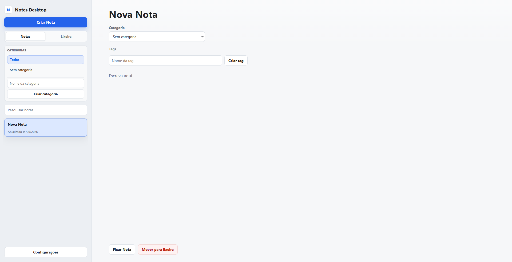

# Notes Desktop

**Notes Desktop** is a local-first desktop note-taking app built with **React**, **TypeScript**, **Vite** and **Electron**.

The app allows you to create, edit, organize, search, categorize, tag, back up and manage notes completely offline, with local persistence through Electron.

---

## Preview

```md
## Preview



---

## Features

### Notes

- Create notes
- Edit note title
- Edit note content
- Search notes
- Pin and unpin notes
- Sort notes by last update
- Show last updated date
- Empty state when no note is selected

### Trash

- Move notes to trash
- Restore notes from trash
- Permanently delete notes
- Empty trash
- Confirm destructive actions with modal dialogs

### Multiple Selection in Trash

- Select multiple trashed notes
- Select all trashed notes
- Clear selection
- Restore selected notes
- Permanently delete selected notes with confirmation

### Categories

- Create categories
- Filter notes by category
- Show all notes
- Show uncategorized notes
- Assign a category to a note
- Change a note category from the editor
- Delete categories
- Notes from deleted categories become uncategorized

### Tags

- Create tags
- Add tags to notes
- Remove tags from notes
- Delete tags
- Deleted tags are removed from all notes
- Filter notes by tag

### Settings

- Toggle light/dark mode
- Toggle language between PT-BR and EN
- Import backup
- Export backup

### Backup

- Export all notes, categories and tags to JSON
- Import notes, categories and tags from JSON
- Works fully offline

---

## Local-first

Notes Desktop does not require an internet connection.

All data is stored locally on the user's machine using Electron and the file system.

Current local data format:

```ts
export type NotesData = {
  notes: Note[];
  categories: Category[];
  tags: Tag[];
};
```

Note structure:

```ts
export type Note = {
  id: string;
  title: string;
  content: string;
  createdAt: string;
  updatedAt: string;
  pinned: boolean;
  deleted: boolean;
  categoryId: string | null;
  tagIds: string[];
};
```

Category structure:

```ts
export type Category = {
  id: string;
  name: string;
  createdAt: string;
};
```

Tag structure:

```ts
export type Tag = {
  id: string;
  name: string;
  createdAt: string;
};
```

---

## Technologies

### Frontend

- React
- TypeScript
- Vite
- CSS Modules/Component CSS structure

### Desktop

- Electron
- Electron Builder

### Development

- npm
- Git
- ESLint

---

## Project Structure

```text
src/
├── components/
│   ├── EmptyState/
│   │   ├── EmptyState.tsx
│   │   └── EmptyState.css
│   │
│   ├── Modal/
│   │   ├── ConfirmModal/
│   │   │   ├── ConfirmModal.tsx
│   │   │   └── ConfirmModal.css
│   │   └── SettingsModal/
│   │       ├── SettingsModal.tsx
│   │       └── SettingsModal.css
│   │
│   ├── NoteEditor/
│   │   ├── NoteEditor.tsx
│   │   └── NoteEditor.css
│   │
│   ├── NoteList/
│   │   ├── NoteList.tsx
│   │   └── NoteList.css
│   │
│   └── Sidebar/
│       ├── Sidebar.tsx
│       ├── Sidebar.css
│       └── components/
│           ├── SidebarCategories.tsx
│           ├── SidebarFooter.tsx
│           ├── SidebarHeader.tsx
│           ├── SidebarSearch.tsx
│           ├── SidebarTabs.tsx
│           ├── SidebarTagsFilter.tsx
│           └── SidebarTrashActions.tsx
│
├── hooks/
│   ├── useNotes.ts
│   ├── useTheme.ts
│   └── useLanguage.ts
│
├── locales/
│   ├── pt-BR.ts
│   └── en.ts
│
├── pages/
│   └── HomePage/
│       ├── HomePage.tsx
│       └── HomePage.css
│
└── types/
    ├── Category.ts
    ├── Language.ts
    ├── Note.ts
    ├── NotesData.ts
    ├── SelectedCategoryId.ts
    ├── SelectedTagId.ts
    ├── Tag.ts
    ├── Theme.ts
    └── ViewMode.ts
```

Electron files:

```text
electron/
├── main.cjs
├── preload.cjs
└── assets/
```

Build icons:

```text
build/
└── icons/
    └── icon.ico
```

---

## Sidebar Architecture

The sidebar is split into smaller components to keep the main `Sidebar.tsx` component easier to read and maintain.

Current sidebar subcomponents:

```text
Sidebar
├── SidebarHeader
├── SidebarTabs
├── SidebarCategories
├── SidebarTagsFilter
├── SidebarTrashActions
├── SidebarSearch
├── NoteList
└── SidebarFooter
```

Responsibilities:

* `SidebarHeader`: displays the app mark and app name.
* `SidebarTabs`: switches between Notes and Trash views.
* `SidebarCategories`: handles category filters, category creation and category deletion request.
* `SidebarTagsFilter`: handles tag-based note filtering.
* `SidebarTrashActions`: contains trash actions and multiple-selection actions.
* `SidebarSearch`: handles the search input.
* `SidebarFooter`: displays the settings button.
* `NoteList`: renders the visible notes for the current view.

---

## Getting Started

### Clone the repository

```bash
git clone https://github.com/JoaoOliveira20/notes-desktop.git
cd notes-desktop
```

### Install dependencies

```bash
npm install
```

### Run in development mode

```bash
npm run electron:dev
```

This command starts the Vite development server and opens the Electron desktop app.

---

## Available Scripts

### Run Vite only

```bash
npm run dev
```

### Run Electron only

```bash
npm run electron
```

### Run Vite + Electron

```bash
npm run electron:dev
```

### Build frontend

```bash
npm run build
```

Output:

```text
dist/
```

### Generate desktop build

```bash
npm run dist
```

This command:

1. Builds the React/Vite app
2. Packages the Electron app
3. Generates the final desktop build

Output:

```text
build-release/
```

Example output on Windows:

```text
build-release/
├── Notes Desktop Setup 0.0.0.exe
└── win-unpacked/
```

---

## Electron Builder Configuration

The app uses `electron-builder` with output configured to:

```json
"directories": {
  "output": "build-release"
}
```

Windows icon:

```json
"win": {
  "icon": "build/icons/icon.ico",
  "target": "nsis"
}
```

---

## Data and Backup Flow

```text
React
 ↓
window.electronAPI
 ↓
Electron preload
 ↓
IPC
 ↓
Electron main process
 ↓
notes-data.json
```

Exported backups include:

- notes
- categories
- tags

Example backup format:

```json
{
  "notes": [],
  "categories": [],
  "tags": []
}
```

---

## Development Notes

Generated folders should not be committed:

```text
node_modules/
dist/
release/
build-release/
```

Recommended `.gitignore` entries:

```gitignore
node_modules/
dist/
release/
build-release/
```

---

## Current Version Scope

The current version includes the core functionality for a complete local note-taking app:

- Local note management
- Trash system
- Categories
- Tags
- Filters
- Backup
- Theme
- Language support
- Desktop build

---

## Future Improvements

Possible future improvements:

- Markdown support
- Keyboard shortcuts
- Better note export formats
- More advanced search
- Custom sorting
- Drag and drop
- Rich text editor
- Automatic backup location
- App lock/password protection
- More themes

---

## Author

Developed by **João Oliveira**.
